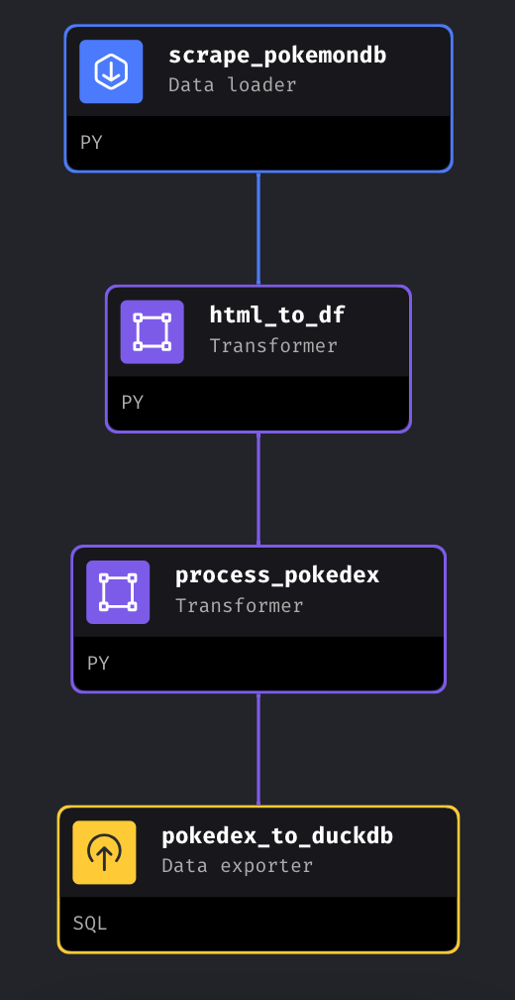
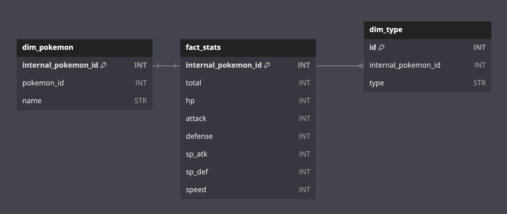

# pokemondb_pipeline

  

This is a toy project inspired by [this post](https://www.facebook.com/groups/dataengineeringpilipinas/posts/1415642842405112/) on Data Engineering Pilipinas. It's a complete data pipeline powered by [Mage](https://mage.ai) that scrapes from [pokemondb](https://pokemondb.net/pokedex/all) and exports it into .sql files compatible with [DuckDB](https://duckdb.org).

## Quickstart
The exported data is already available at `/sql_export`. You may use DuckDB's `IMPORT DATABASE` statement to load the data.

Otherwise, if you'd like to run the full Mage project, clone the repository and follow [this guide](https://docs.mage.ai/production/ci-cd/local-cloud/repository-setup). Make sure you have Docker ready on your environment.

## Business Case
What follows is a hypothetical situation that provides justification for the choices made in the data schema and architecture. I made these as personal guidelines to simulate a real-world use case.

Organization XYZ's ML team wants to develop a model that simulates Pokemon battles. As part of their effort, they need a dataset that describes each Pokemon that was ever officially released. The team found a table containing the data they need, however, it's stored in a website that does not expose a public API. Thus, they hired a data engineer whose job is to build a pipeline that automatically scrapes the data and creates the dataset they need.

Apart from the work being automated, the ML team has also asked that the pipeline should be automatically scheduled and easily scalable. They want to make sure that it can account for any Pokemon that are released now, and those that are yet to be released, without needing much manual intervention.

In addition, the organization's data team is quite small. Thus, they want their data warehouse to be easily comprehensible even by non-technical users who wants to perform EDA on the data. In addition, they also want to abstract the underlying architecture such that they can allocate most of their time on maintaining the actual pipeline.

## Data Pipeline
The main pipeline is composed of 4 blocks:

  

You may find the code for each block located within the corresponding directory in the project. For instance, the SQL code for `pokedex_to_duckdb` is located at [`data_exporters/pokedex_to_duckdb.sql`](https://github.com/jarcelao/pokemondb_pipeline/blob/master/data_exporters/pokedex_to_duckdb.sql)

## Data Schema
The scraped data has been transformed to follow a star schema. In other words, the data warehouse is designed to follow Kimball methodology. Here's the schema visualized:

  

We make the assumption here that we want to use a Pokemon's stats as the fact table, as they are values that quantitatively describe our target business object (i.e. a Pokemon). We also create the field `internal_pokemon_id` as evolutions of the same Pokemon are assigned the same ID in the dataset.

## Data Architecture
We use Mage as the main orchestrator for the data pipeline. Apart from providing typical orchestration capabilities (e.g. DAGs, Schedule Triggers), it also prides itself on its ease of use for small data teams who want to focus on the actual pipeline logic. In a production environment, Mage can be deployed as a managed Docker container in a service such as [GCP Cloud Run](https://cloud.google.com/run?hl=en).

As a PoC, DuckDB already functions as a capable in-memory OLAP database to serve as our data warehouse. In a production environment, an open-source solution such as [ClickHouse](https://clickhouse.com/) or a fully managed solution such as [GCP BigQuery](https://cloud.google.com/bigquery) can serve as the data warehouse target.
